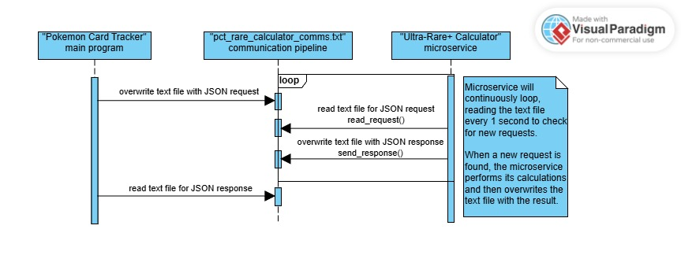

## Pokemon Card Tracker Microservice: Ultra-Rare+ Calculator

This microservice was developed for a "Pokemon Card Tracker" program.
The purpose of this microservice is to compare a user's collection of Pokemon cards
against the complete set of Pokemon cards to determine how many of the ultra-rare or higher (ultra-rare+)
cards from a given set the user owns. The microservice responds with a few data points,
including the number of ultra-rare cards that exist within the given set, the number of those ultra-rare cards
that the user owns in their collection, the percentage of ultra-rare+ cards that the user owns in their collection,
and details about all of the ultra-rare+ cards that the user is still missing.

## How to Run the Microservice

**Libraries:** This microservice uses only the built-in Python libraries json and time.
No additional libraries are required.

**Database:** This microservice references a JSON file that acts as a pseudo-database of all Pokemon cards.
By default, the microservice specifically looks for a local file named "cards.json".
The file is included in the repository and must be downloaded along with the Python program.

**Communication Pipeline:** This microservice utilizes a text file as its communication pipeline. By default,
the microservice reads and writes to a text file name "pct\_rare\_calculator\_comms.txt". This file is included
in the repository and can be downloaded along with the Python program. However, the program will also create
a new text file with that name if one is not found.

**Test Program:** In case the main program is not available, there is a test program named "test.py" included
in the repository. It can be downloaded and ran as a separate process to emulate the main program. This test
program sends 4 test requests to the microservice, and it prints each request sent and each response received.

**Steps:**

1. Download the microservice program "pct\_rare\_calculator.py" and the database file "cards.json" from this repository.
2. (Optional) Download the test program "test.py" from this repository.
3. Run the microservice program on a command line shell such as Windows PowerShell
   with the command "python pct\_rare\_calculator.py".
4. (Optional) Run the test program on a separate command line shell instance
   with the command "test.py".

## How to Programmatically Request Data from the Microservice

Overwrite the text file "pct\_rare\_calculator\_comms.txt" with a JSON-formatted dictionary
that includes the following key/value pairs:

* "action": The specific command/request being sent. For this microservice,
  the action must be "calculate\_ultra\_rare\_plus".

* "set": The Pokemon card set that the user wants to compare their collection against.

* "collection": A list of all Pokemon cards in the user's collection. Each card must be formatted
  as a JSON-style dictionary with the following key/value pairs:

  * "name": The name of the Pokemon. E.g., "Bulbasaur"
  * "set": The set that the card belongs to. E.g., "Brilliant Stars"
  * "number": The number of the card. E.g., "016/165"
  * "rarity": The level/type of rarity of the card. E.g., "Special Illustration Rare"

**Example Request:**

{'action': 'calculate\_ultra\_rare\_plus',  
'set': '151',  
'collection': \[  
   {'name': 'Bulbasaur', 'set': '151', 'number': '001/165', 'rarity': 'Common'},  
{'name': 'Charmander', 'set': '151', 'number': '004/165', 'rarity': 'Common'},  
{'name': 'Squirtle', 'set': '151', 'number': '007/165', 'rarity': 'Common'},  
{'name': 'Pidgey', 'set': '151', 'number': '016/165', 'rarity': 'Common'},  
{'name': 'Rattata', 'set': '151', 'number': '019/165', 'rarity': 'Common'},  
{'name': 'Mew ex', 'set': '151', 'number': '205/165', 'rarity': 'Hyper Rare'},  
{'name': 'Charizard ex', 'set': '151', 'number': '199/165', 'rarity': 'Special Illustration Rare'},  
{'name': 'Venusaur ex', 'set': '151', 'number': '182/165', 'rarity': 'Ultra Rare'},  
{'name': 'Blastoise ex', 'set': '151', 'number': '184/165', 'rarity': 'Ultra Rare'},  
{'name': "Erika's Invitation", 'set': '151', 'number': '203/165', 'rarity': 'Special Illustration Rare'},  
{'name': 'Bulbasaur', 'set': '151', 'number': '166/165', 'rarity': 'Illustration Rare'},  
{'name': 'Charmander', 'set': '151', 'number': '168/165', 'rarity': 'Illustration Rare'},  
{'name': 'Squirtle', 'set': '151', 'number': '170/165', 'rarity': 'Illustration Rare'}  
]  
}

## How to Programmatically Receive Data from the Microservice

Read the text file "pct\_rare\_calculator\_comms.txt". You will find a JSON-formatted dictionary
that includes the following key/value pairs:

* "percentage\_collected": The percentage of ultra-rare+ cards from that set that have been collected.
  Formatted as a decimal with up to 4 decimal places. E.g., 0.1925 (meaning 19.25%)

* "total\_cards": The total number of ultra-rare+ cards that exist within that set.
  Formatted as an integer. E.g., 42

* "collected\_cards": The number of ultra-rare+ cards from that set that have been collected.
  Formatted as an integer. E.g., 12

* "missing\_cards": A list of all the ultra-rare+ cards from that set that are missing from the user's collection.
  Each card will be formatted as a JSON-style dictionary with the following key/value pairs:

  * "name": The name of the Pokemon. E.g., "Bulbasaur"
  * "set": The set that the card belongs to. E.g., "Brilliant Stars"
  * "number": The number of the card. E.g., "016/165"
  * "rarity": The level/type of rarity of the card. E.g., "Special Illustration Rare"

**Example Response:**

{'percentage\_collected': 0.1905,  
'total\_cards': 42,  
'collected\_cards': 8,  
'missing\_cards': \[  
{'name': 'Ivysaur', 'set': '151', 'number': '167/165', 'rarity': 'Illustration Rare'},  
{'name': 'Charmeleon', 'set': '151', 'number': '169/165', 'rarity': 'Illustration Rare'},  
{'name': 'Wartortle', 'set': '151', 'number': '171/165', 'rarity': 'Illustration Rare'},  
{'name': 'Caterpie', 'set': '151', 'number': '172/165', 'rarity': 'Illustration Rare'},  
{'name': 'Pikachu', 'set': '151', 'number': '173/165', 'rarity': 'Illustration Rare'},  
{'name': 'Nidoking', 'set': '151', 'number': '174/165', 'rarity': 'Illustration Rare'},  
{'name': 'Psyduck', 'set': '151', 'number': '175/165', 'rarity': 'Illustration Rare'},  
{'name': 'Poliwhirl', 'set': '151', 'number': '176/165', 'rarity': 'Illustration Rare'},  
{'name': 'Machoke', 'set': '151', 'number': '177/165', 'rarity': 'Illustration Rare'},  
{'name': 'Tangela', 'set': '151', 'number': '178/165', 'rarity': 'Illustration Rare'},  
{'name': 'Mr. Mime', 'set': '151', 'number': '179/165', 'rarity': 'Illustration Rare'},  
{'name': 'Omanyte', 'set': '151', 'number': '180/165', 'rarity': 'Illustration Rare'},  
{'name': 'Dragonair', 'set': '151', 'number': '181/165', 'rarity': 'Illustration Rare'},  
{'name': 'Ninetales ex', 'set': '151', 'number': '183/165', 'rarity': 'Ultra Rare'},  
{'name': 'Golem ex', 'set': '151', 'number': '185/165', 'rarity': 'Ultra Rare'},  
{'name': 'Kangaskhan ex', 'set': '151', 'number': '186/165', 'rarity': 'Ultra Rare'},  
{'name': 'Jynx ex', 'set': '151', 'number': '187/165', 'rarity': 'Ultra Rare'},  
{'name': 'Mew ex', 'set': '151', 'number': '188/165', 'rarity': 'Ultra Rare'},  
{'name': 'Machamp ex', 'set': '151', 'number': '189/165', 'rarity': 'Ultra Rare'},  
{'name': 'Dodrio ex', 'set': '151', 'number': '190/165', 'rarity': 'Ultra Rare'},  
{'name': 'Electrode ex', 'set': '151', 'number': '191/165', 'rarity': 'Ultra Rare'},  
{'name': 'Gengar ex', 'set': '151', 'number': '192/165', 'rarity': 'Ultra Rare'},  
{'name': 'Snorlax ex', 'set': '151', 'number': '193/165', 'rarity': 'Ultra Rare'},  
{'name': 'Dragonite ex', 'set': '151', 'number': '194/165', 'rarity': 'Ultra Rare'},  
{'name': 'Moltres ex', 'set': '151', 'number': '195/165', 'rarity': 'Ultra Rare'},  
{'name': 'Articuno ex', 'set': '151', 'number': '196/165', 'rarity': 'Ultra Rare'},  
{'name': 'Zapdos ex', 'set': '151', 'number': '197/165', 'rarity': 'Ultra Rare'},  
{'name': 'Venusaur ex', 'set': '151', 'number': '198/165', 'rarity': 'Special Illustration Rare'},  
{'name': 'Blastoise ex', 'set': '151', 'number': '200/165', 'rarity': 'Special Illustration Rare'},  
{'name': 'Alakazam ex', 'set': '151', 'number': '201/165', 'rarity': 'Special Illustration Rare'},  
{'name': 'Zapdos ex', 'set': '151', 'number': '202/165', 'rarity': 'Special Illustration Rare'},  
{'name': "Giovanni's Charisma", 'set': '151', 'number': '204/165', 'rarity': 'Special Illustration Rare'},  
{'name': 'Switch', 'set': '151', 'number': '206/165', 'rarity': 'Hyper Rare'},  
{'name': 'Basic Energy', 'set': '151', 'number': '207/165', 'rarity': 'Hyper Rare'}  
]  
}

## UML Sequence Diagram

